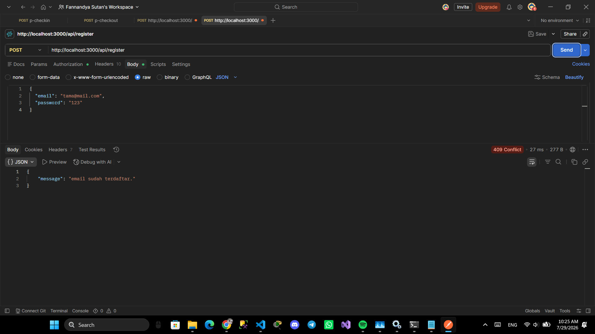
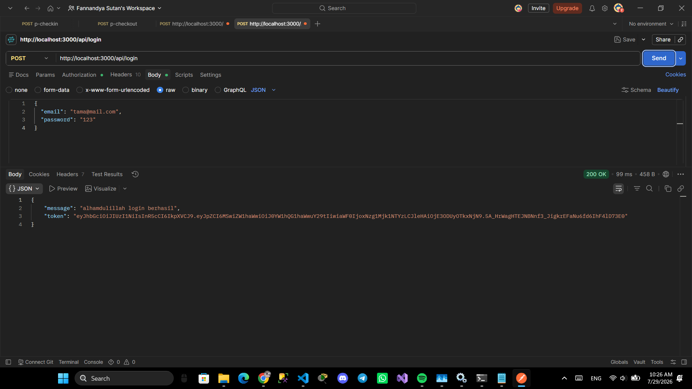
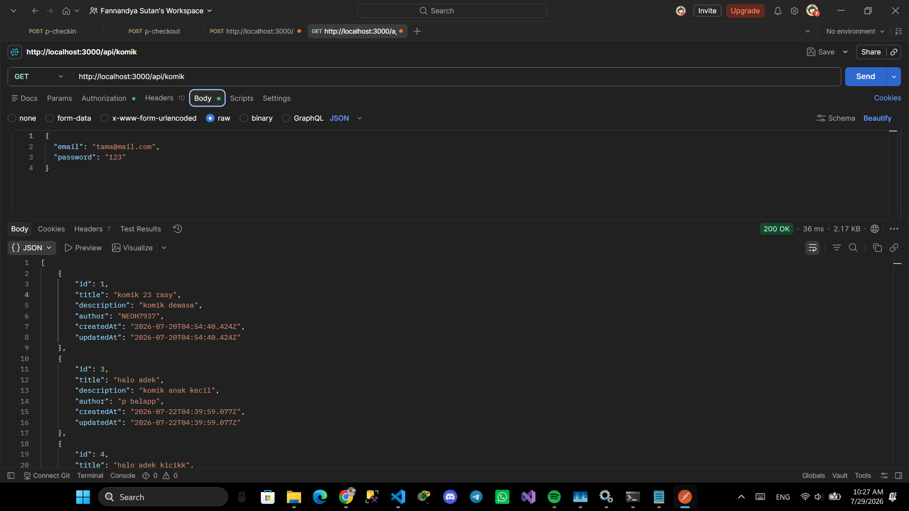
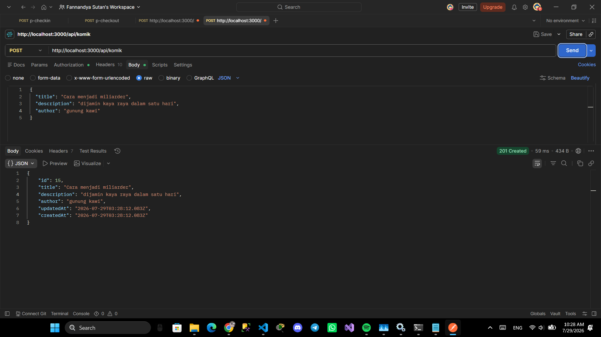
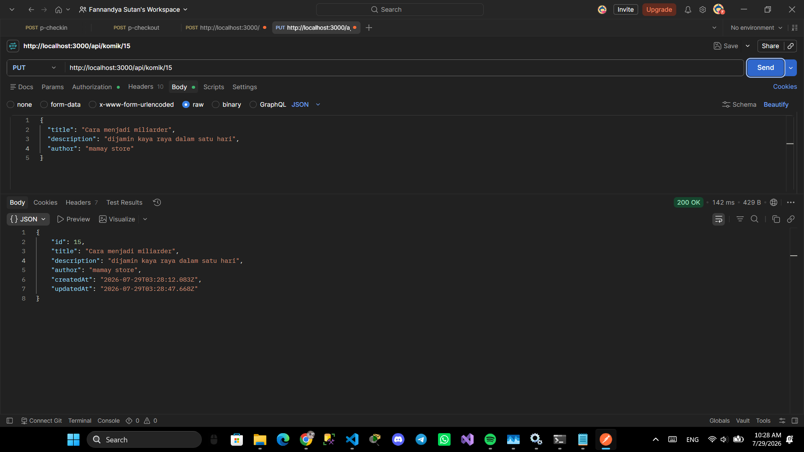
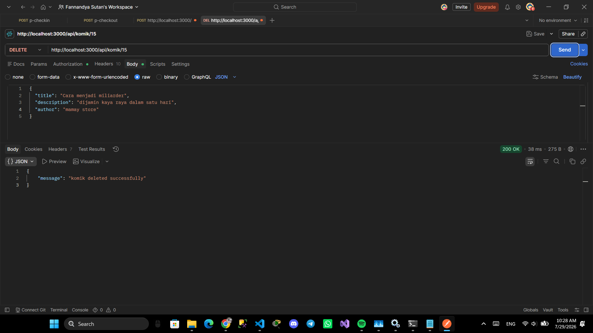
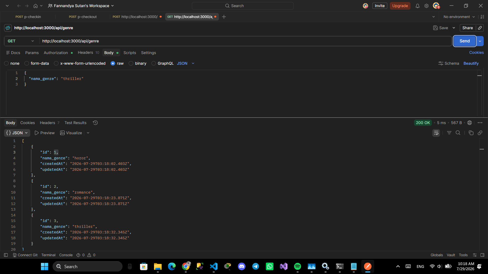
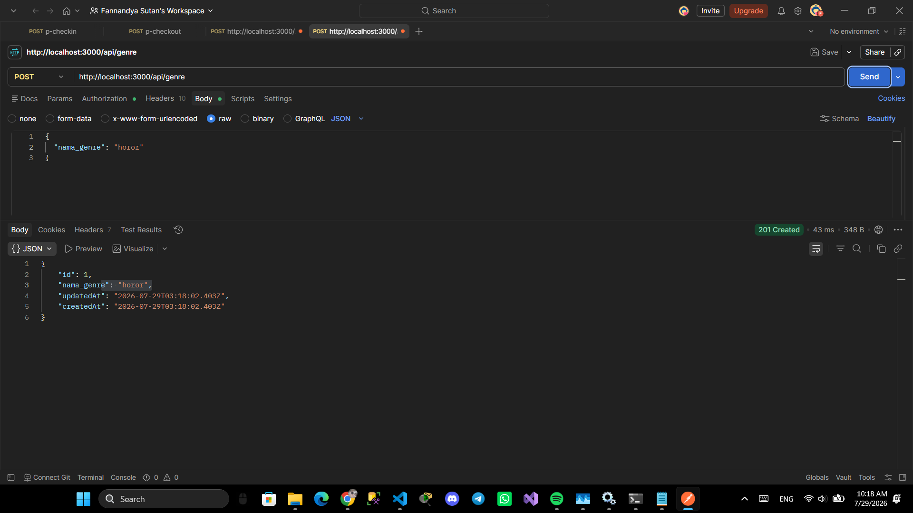
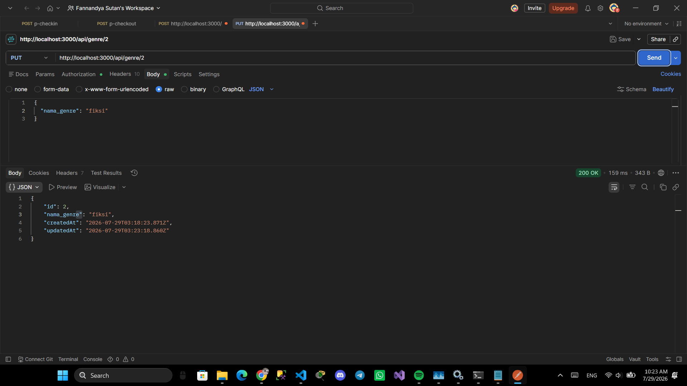
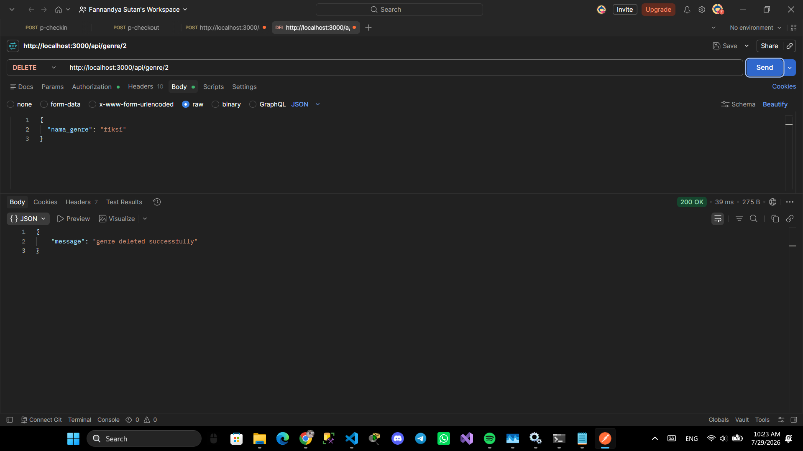

# API Login JWT

RESTful API authentication menggunakan JWT (JSON Web Token) dengan fitur CRUD data komik dan genre.

## Tech Stack

- **Runtime:** Node.js
- **Framework:** Express
- **ORM:** Sequelize
- **Database:** PostgreSQL
- **Auth:** JWT (jsonwebtoken) + bcrypt

## Fitur

- Register user
- Login user (mendapatkan JWT token)
- CRUD komik dan genre dengan proteksi autentikasi

## Cara Install & Run

1. Clone repositori ini
2. Install dependencies
   ```bash
   npm install
   ```
3. Buat database PostgreSQL sesuai konfigurasi
4. Atur file `.env` berdasarkan kebutuhan
5. Jalankan server
   ```bash
   npm start
   ```

## Environment Variables

| Variable      | Deskripsi                   |
| ------------- | --------------------------- |
| DB_USERNAME   | Username PostgreSQL         |
| DB_PASSWORD   | Password PostgreSQL         |
| DB_DATABASE   | Nama database               |
| DB_HOST       | Host database               |
| DB_PORT       | Port database               |
| DB_DIALECT    | Dialect database (postgres) |
| JWT_SECRET    | Secret key untuk JWT        |
| JWT_EXPIRES   | Expiry token (contoh: 1h)   |

## API Endpoints

| Method | Endpoint        | Auth | Keterangan           |
| ------ | --------------- | ---- | -------------------- |
| POST   | `/api/register` | ❌   | Register user baru   |
| POST   | `/api/genre`    | ✅   | Tambah Genre         |
| POST   | `/api/login`    | ❌   | Login & dapat token  |
| GET    | `/api/genre`    | ❌   | Lihat semua genre    |
| GET    | `/api/genre/:id`| ❌   | Lihat genre by ID    |
| GET    | `/api/komik`    | ❌   | Lihat semua komik    |
| GET    | `/api/komik/:id`| ❌   | Lihat komik by ID    |
| POST   | `/api/komik`    | ✅   | Tambah komik         |
| PUT    | `/api/genre/:id`    | ✅   | Ubah Genre           |
| PUT    | `/api/komik/:id`| ✅   | Ubah komik           |
| DELETE | `/api/delete/:id`|✅   | Hapus komik
| DELETE | `/api/komik/:id`| ✅   | Hapus komik          |
| 

## Screenshot

Post Register 
Post Login 

Get Komik 
Post Komik 
Put Komik 
Delete Komik 

Get Genre 
Post Genre 
Put Genre 
Delete Genre 

